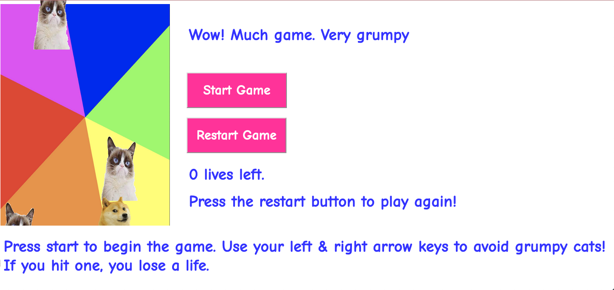

# Object Oriented Programming Game Project

## The game

This game is called **Wow! Much game. Very grumpy**. In the game, you play as Doge. The only thing you can do is move left or right with the arrows of your keyboard.

The goal of the game is to stay alive as long as possible by avoiding the Grumpy Cats who are raining from the sky and trying to get you. The longer you stay alive, the higher your score!

## Changes Made
Game Rules:
- As you play, the enemies' speed gets faster and faster
- You get **3** lives at the start of the game. Once you lose all your lives, you lose and you have to start over!
- You have to press the "start game" button to begin playing
- Once you lose all three lives, you have to click the "restart game" button to play again

Game Design:
- The game is now about Grumpy Cat vs. Doge with a late 2000s meme background
- The game's instructions are located at the bottom
- The game title is located at the top
- There are the two buttons needed to play the game: the start button and the restart button
- There's a count for the number of lives you have left
- There's your score at the top left-hand corner of the game board
- When you lose all three lives, there are instructions telling you how to keep playing!

## Netlify Link

